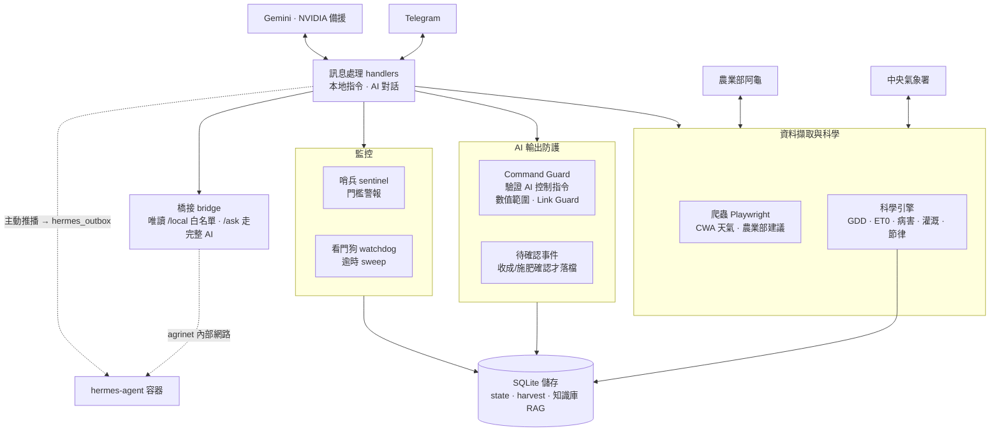

# agribot 架構

自主農務監控 Telegram bot：爬中央氣象署與農業部資料，跑科學引擎（GDD/ET0/病害/灌溉/節律），
由 Gemini 做 AI 對話與閉環控制，所有會改狀態的動作都經防護欄驗證。

## 設計重點

- **AI 不直接寫狀態**：Gemini 吐出的閉環控制指令（調門檻、切作物）一律經 `agent/guard.py` 的
  Command Guard 驗證——數值範圍檢查（`0 < dry < wet < 100`、單次調幅上限）、AI 回覆中的連結一律移除。
- **破壞性事件要確認**：收成/施肥會寫進長期記錄，先登記為「待確認」，使用者確認或喊停視窗逾時才落檔
  （`agent/pending.py`，threading.Lock 認領 + contextvars 隔離併發）。
- **橋接最小開放**：`bridge/server.py` 只監聽內部 Docker 網路、要求 HMAC 共用密鑰、body 上限、
  socket timeout、`/local` 唯讀白名單伺服器端強制；啟動失敗只停用 bridge、不拖垮核心 bot。
- **防注入**：爬回的網頁文字與農業建議當不可信資料，防間接 prompt injection。

## 部署

走 Synology Drive 自動同步 → NAS `/volume2/docker/agriweather-bot/` → Container Manager。
commit 用 **GitHub Desktop**（勿用 CLI）。改 `.py` 要**重建容器**才生效
（`bridge/` 等是 Dockerfile `COPY` 進 image，非 bind mount）。NAS 容器名為 `agriweather-bot`。
